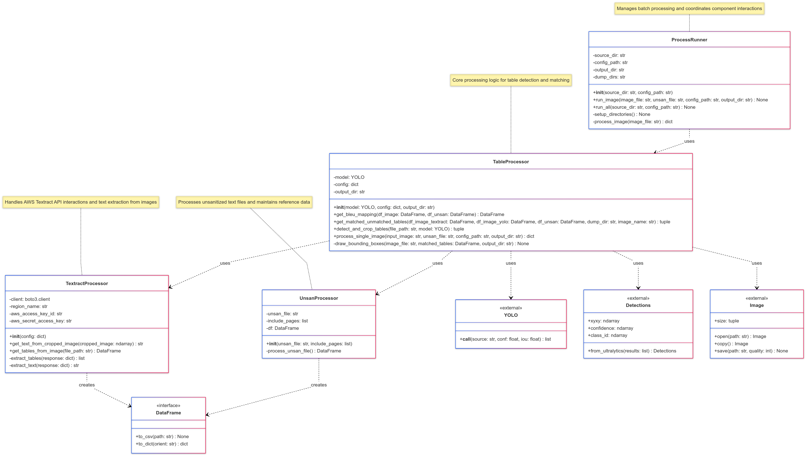
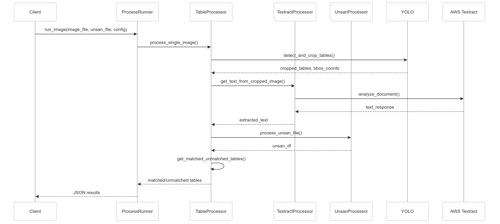

# Hybrid Table Detection and Analysis System Design Document

## 1. System Overview

The system is designed to detect, extract, and analyze tables from images using a combination of AWS Textract and YOLO object detection. It compares the detected tables with a reference unsanitized (unsan) text file to match and validate table contents.

### 1.1 Key Features
- Table detection using YOLO neural network model
- Text extraction using AWS Textract
- Table matching using BLEU score comparison
- Support for batch processing of multiple images
- Generation of detailed analysis reports

## 2. Architecture

### 2.1 Core Components

1. **TextractProcessor**
   - Handles all AWS Textract interactions
   - Extracts text and table information from images
   - Processes both full images and cropped table regions

2. **UnsanProcessor**
   - Processes unsanitized text files
   - Extracts reference table content and page numbers
   - Maintains mapping between table content and page numbers

3. **Table Detection System**
   - Uses YOLO model for table detection
   - Handles image preprocessing and bounding box extraction
   - Supports both single image and batch processing

### 2.2 Data Flow

1. Input Processing:
   - Image files are loaded and preprocessed
   - Unsanitized text file is parsed and indexed
   - Configuration settings are loaded

2. Table Detection:
   - YOLO model detects table regions
   - Bounding boxes are extracted and normalized
   - Tables are cropped from original image

3. Text Extraction:
   - Textract processes full image and cropped regions
   - Table structure and content are extracted
   - Results are normalized and stored

4. Table Matching:
   - BLEU scores are calculated between detected and reference tables
   - Best matches are identified and stored
   - Unmatched tables are tracked separately

## 3. Component Details

### 3.1 TextractProcessor Class

**Responsibilities:**
- Initialize AWS Textract client
- Process images and extract text
- Handle table structure extraction
- Manage AWS API interactions

**Key Methods:**
- `get_text_from_cropped_image()`
- `get_tables_from_image()`
- `extract_tables()`
- `extract_text()`

### 3.2 UnsanProcessor Class

**Responsibilities:**
- Parse unsanitized text files
- Extract table content and metadata
- Filter tables by page number
- Maintain data structure for comparison

**Key Methods:**
- `process_unsan_file()`
- `__init__()` with optional page filtering

### 3.3 Utility Functions

**Table Matching:**
- `get_bleu_mapping()`
- `get_matched_unmatched_tables()`
- `draw_bounding_boxes()`

**YOLO Processing:**
- `detect_and_crop_tables()`
- `process_single_image()`

## 4. Data Structures

### 4.1 Table Representation
```python
{
    "TableId": str,
    "Text": str,
    "Left": float,
    "Top": float,
    "Width": float,
    "Height": float,
    "PageNo": int
}
```

### 4.2 Mapping Structure
```python
{
    "table_id": str,
    "image_id": str,
    "image_text": str,
    "unsan_text": str,
    "bleu_score": float,
    "page_no": int,
    "line_no": int
}
```

## 5. Configuration

### 5.1 Required Configuration
```json
{
    "region_name": str,
    "aws_access_key_id": str,
    "aws_secret_access_key": str
}
```

### 5.2 Directory Structure
```
source_dir/
├── images/
├── unsan.txt
├── output/
└── dump/
```

## 6. Error Handling

The system implements error handling for:
- Image processing failures
- AWS Textract API errors
- File I/O operations
- Invalid configuration
- Batch processing errors

## 7. UML Diagrams



